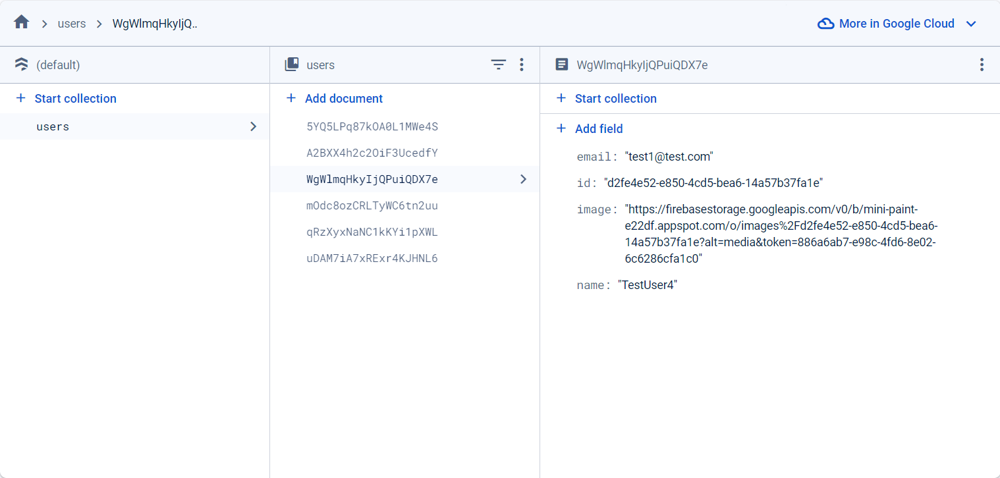

Documentation:

# Project - Innowise Lab Internship: Level 2: Mini-paint

## [Task](https://drive.google.com/file/d/19cb4whI_HUVPzuaPyaj5r6hGotIVnhho/view) - Create an image gallery with built-in graphic editor.

## Technical requirements:

-   [x] Use routing library for data management (e.g React-Redux)
-   [x] Typescript is required
-   [x] Configure ESLint, Prettier, implement pre-commit hook
-   [x] Optimize work with data base (the lesser data base requests, the better)
-   [x] Data base errors should be handled using Toast
-   [x] Documentation is obligatory

## Links:

### [Repository](https://github.com/dibrugh/mini-paint)

### Database snapshot:



## Application stack

Main: React, Redux, Typescript, Firebase, MaterialUI
Additional: React-hook-form, React-select, React-colorful, React-toastify, Yup, Uuid, Vite.

# Available Scripts and Commands

```bash
# Install

npm i                    # install dependencies
```

```bash
# General

> npm dev                # run application locally
> npm build              # build the app for production
> npm lint               # run code quality tools
```

```bash
# Deploy

> npm run deploy         # create production build and deploy app on Github Pages
```

## Folder structure

-   PROJECT
    -   /.husky (git hooks such as pre-commit hook)
    -   /dist (production build of the project)
    -   /node_modules (dependencies)
    -   /src (development version of the project)
        -   /app (app-wide settings, styles and providers)
        -   /pages (compositional layer to construct full pages from entities, features and widgets)
        -   /widgets (compositional layer to combine entities and features into meaningful blocks.)
        -   /features (user interactions, actions that bring business value to the user)
        -   /entities (business entities)
        -   /shared (reusable functionality, detached from the specifics of the project/business)
        -   vite-env.d.ts (typescript declaration)
        -   main.tsx
    -   ...configuration files.
